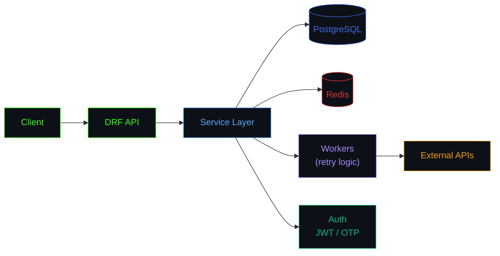

 

## 🧩 Stack

 

## ⚙️ How a Service Flows Through Me

 

## 📊 The Numbers

 

## 🏆 Trophies

 

## 🐍 Contribution Snake

renders after the <code>snake.yml</code> action runs once — see setup notes below

 

## 🧊 Contributions in 3D

renders after the <code>profile3d.yml</code> action runs once — see setup notes below

 

## 📌 Pinned Work

swap the placeholders below for your real repo names once pinned

 

## 📫 Reach Me

<!-- add more badges here once you have the links, e.g.

-->

