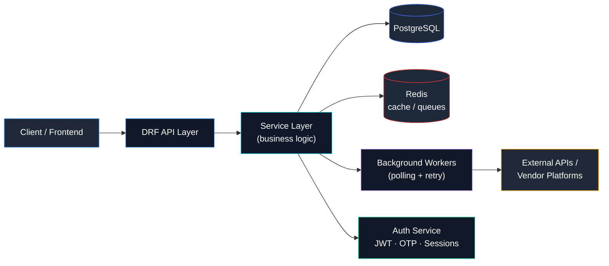

<div align="center">

<!-- ANIMATED HEADER -->


<!-- TYPING ANIMATION -->
<a href="#">
  
</a>

<br/>


</div>

<br/>

## 👋 About Me

I'm a **Backend Developer** focused on **Python / Django / Django REST Framework**, building APIs and services that stay reliable under real-world messiness — external systems going down, data drifting out of sync, and traffic spikes that shouldn't break anything.

Most of my work lives in the layer between *business logic* and *infrastructure*: designing service-oriented backend architecture, modeling databases and their relationships, optimizing queries, and building authentication systems (JWT, OTP, cookie-based auth) that are actually secure, not just functional.

I've spent a good amount of time in **food ordering / e-commerce style systems** — order management, cart logic, payment flows, product & data synchronization with external platforms, vendor integrations, and background workers that retry gracefully instead of silently failing.

```python
class Alireza:
    def __init__(self):
        self.role = "Backend Developer"
        self.stack = ["Python", "Django", "DRF", "PostgreSQL", "Redis"]
        self.focus = [
            "clean service-layer architecture",
            "reliable third-party integrations",
            "data consistency at scale",
            "caching & performance optimization",
        ]

    def philosophy(self) -> str:
        return "Boring, predictable backends are a feature — not a lack of ambition."
```

<br/>

## 🧠 What I Actually Work On

<table>
<tr>
<td width="50%" valign="top">

**🔌 API & Service Design**
- RESTful API development with DRF
- Service-layer architecture & clean separation of concerns
- Business logic modeling
- Database modeling & relationships
- Query optimization & transactions

</td>
<td width="50%" valign="top">

**🔐 Auth & Security**
- JWT-based authentication
- OTP verification systems
- Cookie-based authentication
- Authorization / permission systems
- Session & token lifecycle management

</td>
</tr>
<tr>
<td width="50%" valign="top">

**🔄 Integrations & Sync**
- External API & third-party integrations
- Vendor integrations
- Product & order synchronization
- Data mapping between internal ↔ external systems
- Background / polling workers with retry mechanisms

</td>
<td width="50%" valign="top">

**⚡ Performance & Reliability**
- Redis caching strategies
- Order & cart system design
- Payment flow implementation
- Error handling & fault-tolerant retries
- Data consistency across services

</td>
</tr>
</table>

<br/>

## 🏗️ How I Structure a Backend

A simplified view of the kind of service architecture I typically build — separating transport, business logic, and integrations so each piece can change without breaking the others.



**Principles I follow:**
- Keep the API layer thin — routing and serialization only, never business logic
- Push business rules into a dedicated service layer that's testable in isolation
- Treat external integrations as unreliable by default → retries, idempotency, timeouts
- Cache deliberately, not everywhere — Redis for hot paths, not as a crutch
- Model data relationships to match reality first, optimize queries second

<br/>

## 🛠️ Tech Stack

<div align="center">

**Language**


**Backend**


**Database & Cache**


**Auth**


**Infra & Tools**


</div>

<br/>

## 🎯 Current Focus

- 🔧 Sharpening service-layer architecture patterns for cleaner, more testable Django apps
- 🔄 Building more resilient sync pipelines between internal systems and external vendor platforms
- ⚡ Getting deeper into caching strategy and query performance under real load
- 🔐 Refining auth flows (JWT / OTP) for stronger, more maintainable security

<br/>

## 📊 GitHub Stats

<div align="center">


<br/>


<br/><br/>


</div>

<br/>

<!--
  🐍 CONTRIBUTION SNAKE ANIMATION
  This image will render once you enable the snake workflow (see setup notes at the bottom).
  Until the GitHub Action runs at least once, this line will just show a broken image — that's expected.
-->
<div align="center">


</div>

<br/>

## 📌 Featured Projects

> Pin your top repositories from your GitHub profile (`Customize your pins`) — they'll render as live, auto-updating cards right here.

<div align="center">

<!--
  Replace REPO-NAME-1 / REPO-NAME-2 / REPO-NAME-3 below with your actual repository names
  once you've pinned or decided which projects to feature.
-->
<a href="https://github.com/AlirezaGharahlou/REPO-NAME-1">
  
</a>
<a href="https://github.com/AlirezaGharahlou/REPO-NAME-2">
  
</a>

</div>

<br/>

## 💬 Development Philosophy

<table>
<tr>
<td align="center" width="33%">
<b>Reliability &gt; Cleverness</b><br/>
<sub>A predictable retry mechanism beats a clever one that fails silently.</sub>
</td>
<td align="center" width="33%">
<b>Data consistency first</b><br/>
<sub>Sync bugs are quiet until they aren't. I design against that.</sub>
</td>
<td align="center" width="33%">
<b>Thin API, thick service layer</b><br/>
<sub>Views/serializers stay dumb. Logic lives where it can be tested.</sub>
</td>
</tr>
</table>

<br/>

## 📫 Connect With Me

<div align="center">

[](https://github.com/AlirezaGharahlou)

<!--
  Add more badges here as you like, for example:

  [](YOUR_LINKEDIN_URL)
  [](mailto:YOUR_EMAIL)
  [](YOUR_TELEGRAM_URL)
-->

</div>

<br/>

<div align="center">


<sub>Thanks for scrolling this far — now go check the code. 🐍</sub>

</div>
